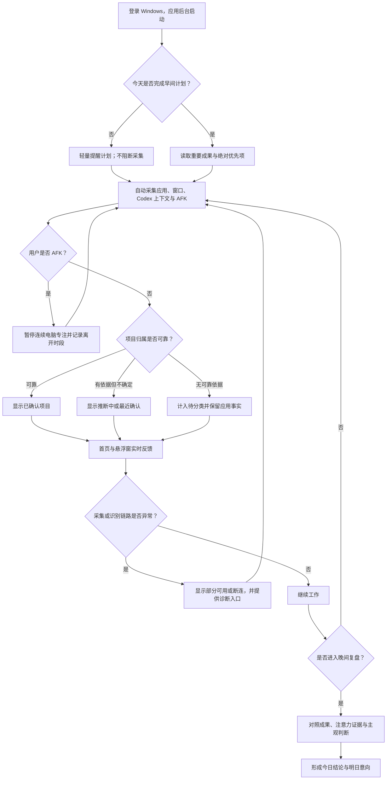
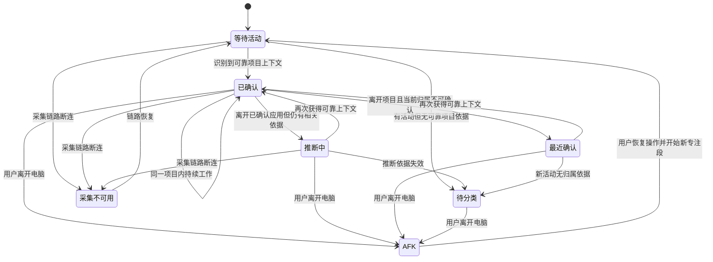

# 产品需求文档：悬浮专注窗与注意力驾驶舱 - V0.3.0

> 状态：需求已确认，待进入技术设计复核与实现
> 产品：时间效率助手
> 平台：Windows 10/11
> 版本名称：悬浮专注窗与注意力驾驶舱
> 核心方向：先把 Windows 上“成果导向的注意力管理”做深；借鉴 Timing 的数据表现和纠错机制；架构保持可跨平台；验证产品成立后再进入 macOS。

## 1. 综述 (Overview)

### 1.1 项目背景与核心问题

v0.2.0 已经打通真实可用链路：ActivityWatch 自动记录前台应用、窗口与 AFK，Codex 上下文识别把同一个 Codex 应用中的注意力进一步拆分到具体项目，早间计划和晚间复盘把电脑证据与成果判断连接起来。

当前主要问题不再是“有没有数据”，而是“数据是否能在工作过程中被快速理解和利用”：

1. 今日概览混入计划提醒、成果空状态、采集控制和多组同等大小的指标，数据主次不清。
2. 项目时间和应用时间没有形成统一、无重复的视觉分母。
3. 旧时间轴把全天数据挤在一起，时间刻度、项目边界和黑色空白难以理解。
4. 用户必须打开主应用才能知道当前项目和连续专注时间。
5. 跨应用项目归属存在不确定性，系统必须诚实表达“已确认、推断中、最近确认、待分类”，不能制造虚假精确。

v0.3.0 的目标是让用户“实时看见注意力”：首页成为注意力驾驶舱，悬浮窗成为低打扰的实时反馈层。活动调查、人工纠错和规则学习不塞入本版，安排在 v0.4.0 的独立“活动明细”页面。

### 1.2 核心业务流程 / 用户旅程地图

1. **早间定成果**：确认最多 3 个重要成果和唯一绝对优先项。
2. **自动采集**：记录前台应用、窗口、Codex 上下文与 AFK。
3. **上下文识别**：判断注意力正在流向哪个项目，并表达可信度。
4. **实时反馈**：首页和悬浮窗显示当前项目、连续专注和时间去向。
5. **查证纠错**：后续通过活动明细查看完整证据并修正错误归属。
6. **晚间复盘**：比较重要成果、注意力投入和主观感受。
7. **规律优化**：积累多日规律，调整未来计划和高强度工作时段。

早间计划、自动采集和晚间复盘是 v0.2.0 已有基础能力；v0.3.0 的新增重点是阶段 3–4，阶段 5 在 v0.4.0 实现，阶段 7 在 v0.5.0 深化。

### 1.3 Mermaid 图（流程/状态/时序）

#### 1.3.1 用户操作流



#### 1.3.2 项目归属与专注状态机



## 2. 用户故事详述 (User Stories)

### 阶段一：实时看见今日注意力

---

#### US-01：作为用户，我希望打开首页后立即看清时间去了哪里、何时发生和当前正在推进什么，以便快速判断今天的注意力状态。

* **价值陈述 (Value Statement)**：
  * **作为** 使用 Windows 进行知识工作的个人用户
  * **我希望** 在首页同时看到时间去向、项目节奏、当前上下文和少量关键指标
  * **以便于** 不翻阅原始窗口流水也能判断今天是否把注意力投入了重要工作
* **业务规则与逻辑 (Business Logic)**：
  1. **前置条件**：应用已启动；系统可以处于真实记录、部分可用、断连或尚无数据状态。
  2. **操作流程 (Happy Path)**：
     1. 顶部显示日期、真实采集状态和当前或最近确认项目。
     2. 已做计划时用一条紧凑区域显示绝对优先成果；未计划时只显示轻量入口。
     3. 左侧注意力圆环以电脑有效活跃时间为唯一分母。
     4. 右侧时间轴展示项目和其他应用在当天的发生时段。
     5. 下方使用紧凑统计条展示活跃时间、最长连续专注、AFK 和项目覆盖率。
     6. 页面下部提供项目注意力排行和应用明细，不把每个指标放进同等大小的大卡片。
  3. **数据规则**：
     * `Codex 已分类项目 + Codex 待分类 + 其他前台应用 = 电脑有效活跃时间`。
     * Codex 父级仅作为分组说明，不作为重复切片。
     * 项目时间和应用时间属于不同观察角度，不能在同一总量中重复相加。
  4. **异常处理 (Error Handling)**：
     * 没有计划：显示紧凑提醒，不占据主数据区。
     * 没有活动：显示等待真实事件的空状态，不渲染示例图表。
     * ActivityWatch 断连：停止实时增长，显示诊断入口。
     * 只有部分项目完成归属：圆环保留待分类切片，项目覆盖率按真实数据计算。

* **页面布局线框图 (ASCII Wireframe)**：

```text
+------------------------------------------------------------------------------------------------+
| 时间效率助手                                                                                   |
+----------------------+-------------------------------------------------------------------------+
| 今日概览             |  2026-07-15                          ● 正在真实记录                     |
| 早间计划             |  当前项目：自媒体创作 / AI口播项目        连续专注 42 分钟              |
| 晚间复盘             +-------------------------------------------------------------------------+
| 诊断                 |  今日绝对优先：完成 AI 口播项目第一版                     [查看计划 >] |
| 设置                 +-------------------------------------------------------------------------+
|                      |  今日注意力去向                 今日时间轴                              |
|                      |       ╭────────╮               08:00  09:00  10:00  11:00  12:00       |
|                      |     ╱  自媒体   ╲              [时间效率助手][Chrome][AI口播项目]       |
|                      |    │  总计3h17m │              [AFK] [时间效率助手] [剪映]               |
|                      |     ╲ 待分类79m ╱                                                       |
|                      |       ╰────────╯               选中：AI口播项目 · 已确认                |
|                      +-------------------------------------------------------------------------+
|                      |  活跃 3h17m     最长专注 42m     AFK 36m     项目覆盖率 49%              |
|                      +-----------------------------------+-------------------------------------+
|                      | 项目注意力排行                    | 应用明细                            |
|                      | 时间效率助手 30m · AI口播 18m     | Codex 2h37m · Chrome 21m           |
+----------------------+-----------------------------------+-------------------------------------+
```

* **验收标准 (Acceptance Criteria)**：
  * **场景 1：真实数据正常展示**
    * **GIVEN** 当天存在真实前台活动和 AFK 事件
    * **WHEN** 用户打开今日概览
    * **THEN** 首屏同时显示圆环、时间轴、当前项目和核心指标，所有叶子切片之和等于有效活跃时间
  * **场景 2：未做计划**
    * **GIVEN** 当天尚未保存早间计划
    * **WHEN** 用户打开今日概览
    * **THEN** 页面只显示紧凑计划提醒，主数据区仍正常展示
  * **场景 3：采集断连**
    * **GIVEN** ActivityWatch 当前不可连接
    * **WHEN** 页面刷新
    * **THEN** 状态明确变为采集不可用，计时停止增长，并提供诊断入口
  * **场景 4：视口适配**
    * **GIVEN** 视口为 1440×900 或 1600×1000
    * **WHEN** 用户查看首屏
    * **THEN** 不出现横向溢出、文字严重重叠或不必要的大面积空白

---

#### US-02：作为用户，我希望通过项目优先的时间轴看清一天中的项目切换与注意力节奏，以便理解什么时候推进了什么。

* **价值陈述 (Value Statement)**：
  * **作为** 同时使用 Codex 和其他应用工作的用户
  * **我希望** 时间轴把同一 Codex 应用拆成具体项目，并保留应用证据
  * **以便于** 避免把所有 Codex 时间误认为同一件事，也避免被大量窗口标题碎片干扰
* **业务规则与逻辑 (Business Logic)**：
  1. **前置条件**：当天至少有一条有效活动；原始应用事实和项目归属判断均可独立保留。
  2. **显示范围**：
     * 使用单轨时间轴，默认放大到实际活动范围，首尾各保留约 30 分钟上下文。
     * 不显示此前被否决的独立 24 小时顶部指针。
     * 5 小时以内提供半小时辅助刻度和每小时文字；更长范围逐步降低文字密度。
  3. **分类与合并规则**：
     * 可靠 Codex 活动按具体项目拆分；不可靠部分显示 Codex 待分类。
     * 其他应用在 v0.3.0 按应用显示。
     * 同一项目内连续的窗口标题变化可在显示层合并，项目变化、归属状态变化或 AFK 必须切块。
     * 显示层合并不改变 ActivityWatch 原始事件和总时长。
  4. **颜色与状态规则**：
     * Codex 项目统一属于绿色家族，通过不同明度和饱和度区分，并统一带 `C` 标识或顶部色条。
     * 已确认使用实心色；推断中使用项目色斜纹；待分类使用低饱和琥珀色；AFK 使用中性灰点阵。
     * 颜色不能成为唯一识别方式，必须同时使用文字、图标或纹理。
  5. **交互规则**：
     * 宽时间块直接显示名称和起止时间。
     * 窄时间块不强塞文字，点击或悬停后在下方详情栏显示准确起止、持续时间、应用和归属状态。
     * v0.3.0 只读查看；v0.4.0 才进入活动调查和归属修正。
  6. **异常处理 (Error Handling)**：
     * 没有可靠项目时保留应用块和待分类，不显示猜测项目。
     * 局部采集缺口显示为数据缺失，不与 AFK 或未来时间混为一类。

* **页面布局线框图 (ASCII Wireframe)**：

```text
+------------------------------------------------------------------------------------------------+
| 今日时间轴                                              活动范围：08:00—13:00                  |
| 08:00        09:00        10:00        11:00        12:00        13:00                         |
|   |-----|-----|-----|-----|-----|-----|-----|-----|-----|-----|-----|                           |
|   [ C 时间效率助手 08:20—09:05 ] [Chrome] [ C AI口播项目 09:18—10:06 ]                        |
|                                        [AFK 10:06—10:24]                                        |
|                                                   [ C 时间效率助手 ] [剪映] [Codex待分类]       |
|                                                                                                |
| [C 薄荷绿] 时间效率助手  [C 青绿] AI口播项目  [琥珀] 待分类  [蓝紫] 其他应用  [灰] AFK         |
| 所有带 C 标识的项目合计为 Codex 注意力，项目与 Codex 不重复计时。                             |
+------------------------------------------------------------------------------------------------+
| 当前选中：AI口播项目 · Codex   09:18—10:06   48分钟   ● 已确认归属                           |
+------------------------------------------------------------------------------------------------+
```

* **验收标准 (Acceptance Criteria)**：
  * **场景 1：项目拆分**
    * **GIVEN** 用户先后在两个 Codex 项目中工作
    * **WHEN** 时间轴展示当天活动
    * **THEN** 两个项目显示为不同色阶的独立块，同时可以识别它们都属于 Codex
  * **场景 2：连续标题变化**
    * **GIVEN** 同一项目中发生多次窗口标题变化且项目归属未变
    * **WHEN** 生成显示时间块
    * **THEN** 页面不会产生大量难以阅读的碎片，原始事件仍被保留
  * **场景 3：窄时间块**
    * **GIVEN** 某个活动持续时间过短，无法容纳文字
    * **WHEN** 用户悬停或点击该块
    * **THEN** 下方详情栏显示准确时间、应用和归属状态，时间轴文字不重叠
  * **场景 4：总量守恒**
    * **GIVEN** 时间轴执行显示层合并
    * **WHEN** 比较合并前后数据
    * **THEN** 有效活跃总时间和各叶子分类总和保持一致

### 阶段二：低打扰地保持实时感知

---

#### US-03：作为用户，我希望不打开主应用也能看到当前项目和连续专注时间，以便在工作过程中保持对注意力方向的感知。

* **价值陈述 (Value Statement)**：
  * **作为** 正在进行长时间电脑工作的用户
  * **我希望** 通过桌面边缘的紧凑悬浮窗持续看到当前项目和连续专注时间
  * **以便于** 在发生上下文切换时及时意识到，而不需要频繁打开主应用
* **业务规则与逻辑 (Business Logic)**：
  1. **前置条件**：主应用后台运行；悬浮窗功能未被用户关闭。
  2. **位置规则**：
     * 首次显示在主屏右上区域，支持拖动到任意屏幕边缘。
     * 记住最后位置、所在显示器和折叠状态。
     * 目标显示器断开时回到主屏右上，不能永久停留在不可见区域。
  3. **折叠态**：只显示当前或最近确认项目、连续电脑专注时间、归属状态和展开入口。
  4. **展开态**：补充当前应用、今日已确认项目时间、状态解释、打开今日概览和临时隐藏。
  5. **注意力规则**：
     * 用户仍在操作电脑时，连续电脑专注可以跨应用继续。
     * 离开可靠项目后，如果当前归属无法确认，项目状态必须改为推断中或最近确认；该段不能强行累计为已确认项目时间。
     * AFK 时连续专注停止；用户回来后开始新的连续专注段。
  6. **显示模式**：默认置顶边缘胶囊；可在设置中切换为只停留桌面；支持本次运行临时隐藏，并从托盘重新显示。
  7. **交互边界**：
     * 不提供手动项目切换。
     * 点击、展开和拖动不应主动夺走当前工作窗口的输入焦点。
     * v0.3.0 不做全屏应用智能避让，用户可临时隐藏。
  8. **异常处理 (Error Handling)**：
     * ActivityWatch 断连时显示采集不可用，停止增长计时。
     * 没有项目依据时显示待分类或最近确认，不能沿用过期项目为当前已确认项目。

* **页面布局线框图 (ASCII Wireframe)**：

```text
折叠态
                                  +--------------------------------------+
                                  | ● AI口播项目   42:18   已确认    [∨] |
                                  +--------------------------------------+

推断中
                                  +--------------------------------------+
                                  | ◐ 最近：AI口播项目  48:06 推断中 [∨] |
                                  +--------------------------------------+

展开态
                                  +--------------------------------------+
                                  | 当前注意力                       [∧] |
                                  +--------------------------------------+
                                  | AI口播项目                          |
                                  | ● 已确认归属                        |
                                  | 连续电脑专注               42:18    |
                                  | 今日项目时间             1小时10分  |
                                  | 当前应用                     Codex   |
                                  | [打开今日概览]       [暂时隐藏]      |
                                  +--------------------------------------+
```

* **验收标准 (Acceptance Criteria)**：
  * **场景 1：默认显示与位置恢复**
    * **GIVEN** 用户首次启动或已保存过悬浮窗位置
    * **WHEN** 应用启动
    * **THEN** 首次显示在主屏右上，后续恢复到有效的最后位置和折叠状态
  * **场景 2：跨应用但项目不确定**
    * **GIVEN** 用户从已确认 Codex 项目切换到无法可靠归属的 Chrome
    * **WHEN** 用户持续操作电脑
    * **THEN** 连续电脑专注继续，项目标签改为推断中或最近确认，项目已确认时间不错误增长
  * **场景 3：AFK**
    * **GIVEN** 用户达到 ActivityWatch 的 AFK 判定
    * **WHEN** 悬浮窗刷新
    * **THEN** 显示已离开电脑并停止计时；恢复操作后开始新的连续专注段
  * **场景 4：断连**
    * **GIVEN** 采集链路不可用
    * **WHEN** 悬浮窗更新
    * **THEN** 显示采集不可用，不显示继续增长的旧计时
  * **场景 5：显示模式**
    * **GIVEN** 用户切换桌面层或临时隐藏
    * **WHEN** 回到普通应用或通过托盘恢复
    * **THEN** 悬浮窗遵循所选模式且可被可靠找回

### 阶段三：保持页面职责和数据可信

---

#### US-04：作为用户，我希望数据、计划、复盘、诊断和设置各自独立，以便每个页面只解决一个清晰问题。

* **价值陈述 (Value Statement)**：
  * **作为** 每天使用该产品计划和复盘的用户
  * **我希望** 通过稳定的侧栏快速进入不同工作阶段
  * **以便于** 数据观察不被编辑表单、诊断信息和系统控制干扰
* **业务规则与逻辑 (Business Logic)**：
  1. **今日概览**：只承担实时数据、轻量计划摘要和当前上下文反馈。
  2. **早间计划**：编辑 1–3 个重要成果和唯一绝对优先项。
  3. **晚间复盘**：填写成果状态、主观效率、AFK 补记、AI 分析和明日意向。
  4. **诊断**：展示 ActivityWatch、窗口采集、AFK、Codex、存储和启动项的真实链路状态。
  5. **设置**：管理采集、开机启动、悬浮窗模式、提醒与隐私。
  6. **活动明细**：在 v0.4.0 实现后加入侧栏；v0.3.0 不显示不可用的占位入口。
  7. **异常处理 (Error Handling)**：页面所需数据不可用时在当前页面就地解释，并提供正确入口，不能把用户自动送入无关编辑流程。

* **页面布局线框图 (ASCII Wireframe)**：

```text
+----------------------+---------------------------------------------------------------+
| 时间效率助手         | 当前页面内容                                                  |
+----------------------+---------------------------------------------------------------+
| 今日概览  ●          | 数据驾驶舱、当前项目、轻量计划摘要                            |
| 早间计划             | 最多 3 个成果和绝对优先项                                     |
| 晚间复盘             | 成果对照、主观判断、AI 分析、明日方向                         |
|                      |                                                               |
| -------------------- |                                                               |
| 诊断                 |                                                               |
| 设置                 |                                                               |
+----------------------+---------------------------------------------------------------+

v0.4.0 起：在“今日概览”下方增加“活动明细”，不改变其他页面职责。
```

* **验收标准 (Acceptance Criteria)**：
  * **场景 1：概览职责**
    * **GIVEN** 用户位于今日概览
    * **WHEN** 浏览首屏
    * **THEN** 不出现完整计划表单、完整复盘表单、AFK 补记表单或采集开关
  * **场景 2：功能导航**
    * **GIVEN** 用户要修改计划、填写复盘或检查断连
    * **WHEN** 点击相应侧栏入口或页面轻量链接
    * **THEN** 进入对应独立页面，已保存数据保持不变
  * **场景 3：未来入口**
    * **GIVEN** 当前版本仍为 v0.3.0
    * **WHEN** 用户查看侧栏
    * **THEN** 不出现无法使用的活动明细占位项

---

#### US-05：作为用户，我希望系统明确区分真实记录、推断和异常状态，以便相信页面显示的数据。

* **价值陈述 (Value Statement)**：
  * **作为** 依靠数据做每日复盘的用户
  * **我希望** 所有关键模块如实显示数据可信度和链路状态
  * **以便于** 不会把过期数据、推断结果或断连误认为真实记录
* **业务规则与逻辑 (Business Logic)**：
  1. 全局状态至少包括：正在真实记录、采集已暂停、部分可用、采集不可用。
  2. 项目归属至少包括：已确认、推断中、最近确认、待分类。
  3. 用户状态包括：正在操作、AFK、尚无活动。
  4. 每个状态必须有文字说明；颜色只作为辅助。
  5. 采集断连后所有实时计时停止增长，历史已保存数据继续可见，但必须标注其截止时间或非实时性质。
  6. 项目识别不可用但应用采集仍正常时，应用事实继续展示，项目层降级为待分类。
  7. 本地计划和复盘不依赖 ActivityWatch 在线状态；采集异常不能导致用户填写内容丢失。
  8. 禁止使用演示数据填充真实页面的空状态或错误状态。

* **页面布局线框图 (ASCII Wireframe)**：

```text
+--------------------------------------------------------------------------------+
| 状态：● 正在真实记录                                                          |
+--------------------------------------------------------------------------------+
| 正常：      当前项目 AI口播项目 · 已确认 · 连续专注 42:18                     |
| 部分可用：  应用记录正常；Codex 项目识别暂不可用，新增时间进入待分类           |
| 已暂停：    采集已由用户暂停 · [前往设置恢复]                                  |
| 断连：      ActivityWatch 未连接 · 实时计时已停止 · [查看诊断]                 |
| 空状态：    已连接，正在等待第一批真实窗口事件                                 |
+--------------------------------------------------------------------------------+
```

* **验收标准 (Acceptance Criteria)**：
  * **场景 1：项目识别局部失败**
    * **GIVEN** 应用采集正常但 Codex 项目识别不可用
    * **WHEN** 新活动到达
    * **THEN** 应用时长继续记录，项目时间进入待分类，并显示部分可用说明
  * **场景 2：采集完全断连**
    * **GIVEN** ActivityWatch 服务不可用
    * **WHEN** 页面和悬浮窗刷新
    * **THEN** 所有实时计时停止，历史数据显示为非实时，并提供诊断入口
  * **场景 3：本地填写保护**
    * **GIVEN** 采集链路异常
    * **WHEN** 用户保存早间计划或晚间复盘
    * **THEN** 本地内容仍可保存和重启恢复
  * **场景 4：禁止伪数据**
    * **GIVEN** 当天没有真实事件
    * **WHEN** 用户打开今日概览
    * **THEN** 页面显示等待真实数据，不出现示例时间、示例项目或虚假绿色状态

## 3. 版本范围

### 3.1 v0.3.0 必须交付

- 今日概览采用注意力圆环、自动缩放单轨时间轴和紧凑指标布局。
- Codex 时间按具体项目拆分，同属绿色家族但可区分，不重复计算父级。
- 时间轴显示准确起止、归属状态、AFK 和其他应用事实。
- 新增默认置顶、可折叠、可拖动、可记忆位置的悬浮专注窗。
- 设置支持悬浮窗置顶、桌面层和临时隐藏恢复。
- 计划、复盘、诊断、设置和数据页面职责严格分离。
- 补全加载、空、断连、部分可用、暂停、推断中、最近确认和 AFK 状态。

### 3.2 明确不做

- 不在 v0.3.0 增加活动明细页面、人工归属修正和自动规则学习。
- 不把低置信度的 Chrome、剪映等跨应用时间强行归入最近项目。
- 不实现 Timing 的客户、计费、团队、发票和手动工时体系。
- 不录屏，不采集键盘正文。
- 不实现手机与现实场景自动采集。
- 不实现 macOS 客户端，也不承诺在 Windows 机器上完成 macOS 真实行为验收。
- 不对全屏应用做智能避让。

## 4. 数据定义与不可破坏约束

- **电脑有效活跃时间**：窗口活动与非 AFK 区间的有效交集，作为首页圆环唯一分母。
- **Codex 注意力**：Codex 前台有效活跃时间；由已分类项目和 Codex 待分类组成。
- **项目覆盖率**：已可靠归属的 Codex 项目时间除以全部 Codex 注意力。
- **连续电脑专注**：用户持续非 AFK 的电脑活动时段，可以跨应用继续；AFK 或采集断连终止。
- **已确认项目时间**：仅累计有可靠项目上下文的区间；推断中和最近确认不自动算入。
- **事实层不可覆盖**：项目推断是叠加层，任何推断、合并和改名都不能删除或改写 ActivityWatch 原始应用事实。
- **总量守恒**：任何展示层合并、筛选和颜色调整都不能改变有效活跃总量。

## 5. 依赖、风险与降级

- ActivityWatch 提供前台窗口、应用和 AFK 原始事件；断连时进入明确降级状态。
- Codex 项目识别依赖本机 Codex 上下文能力；不可用时降级为应用事实和待分类。
- 当前项目跨应用延续只能表达推断状态，准确自动归属留到后续规则与纠错能力验证。
- 悬浮窗的置顶、焦点和多显示器行为必须在真实 Windows 环境验收，不能只依赖静态设计稿。
- 图表信息密度必须通过 1440×900 与 1600×1000 截图验证，同时在真实数据量下检查窄时间块和长项目名。

## 6. 发布定位

- **版本号**：v0.3.0
- **版本名称**：悬浮专注窗与注意力驾驶舱
- **GitHub Release 简介**：新增可折叠悬浮专注窗，重构今日注意力驾驶舱，以统一圆环和项目化时间轴展示真实时间去向，并明确区分已确认、推断中、待分类与 AFK 状态。
